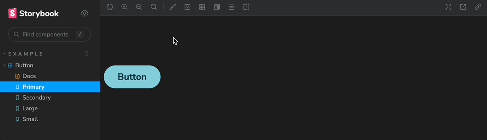

# Stitches Theme Selector

A storybook addon that allows your users to change the theme inside the preview.



### Installation

Install the following npm module:
```bash
npm install multiple-themes-stitches
```
or with yarn:
```bash
yarn add -D multiple-themes-stitches
```

### Configuration

##### Step 1: Add the addon
Add the addon to the config in your .storybook/main.ts file
```js
const config: StorybookConfig = {
  // other config ...
  addons: [
    "multiple-themes-stitches",
    // other addons
  ],
};
export default config;
```

##### Step 2: Add the Themes
Add your themes to your ```stitches.config.ts```
```js
const { createTheme } = createStitches({...});

const darkTheme = createTheme({
  colors: {
    primary: 'rgba(250,55,90,1)',
    secondary: 'rgba(65,125,165,1)',
  },
});

const lightTheme = createTheme({
  colors: {
    primary: 'rgba(65,125,165,1)',
    secondary: 'rgba(245,55,90,1)',
  },
});

const customTheme = createTheme({
  colors: {
    primary: 'rgba(245,100,5,1)',
    secondary: 'rgba(65,125,165,1)',
  },
});
```
And import your stitches Themes to .storybook/preview.ts and then pass the Stitches Themes to the addon via the parameters property
```js
import { Preview } from '@storybook/react';
import { darkTheme, lightTheme } from "../stitches.config";
import { ThemesParameter } from "multiple-theme-stitches";

const multipleThemesStitches: ThemesParameter = {
  values: [
    {
      name: "Light",
      theme: lightTheme,
    },
    {
      name: "Dark",
      theme: darkTheme,
    },
  ],
}
const preview: Preview = {
  parameters: {
    multipleThemesStitches,
    // other parameters
  },
};

export default preview;
```

#### Contributors ✨
Thanks go to these wonderful people
<table>
  <tr>
    <td align="center">
      <a href="https://github.com/MichaelDM">
        
        <br />
        <sub>
          <b>Michael Machiah</b>
        </sub>
      </a>
    </td>
    <td align="center">
      <a href="https://github.com/Noah-Lc">
        
        <br />
        <sub>
          <b>Noah Belahcen</b>
        </sub>
      </a>
    </td>
    <td align="center">
      <a href="https://github.com/mathisobadia">
        
        <br />
        <sub>
          <b>Mathis Obadia</b>
        </sub>
      </a>
    </td>  
  </tr>
</table>

Made with ☕